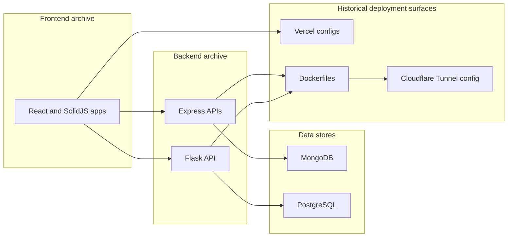

# Architecture

`web-oldies` is a historical multi-project archive. It does not implement one shared application architecture, one package workspace, or one deployable system. The architectural unit is the individual subproject.

The root repository only groups these projects by broad category:

- `backend/`: API, database, Docker, and tunnel experiments.
- `frontend/`: React and SolidJS frontend experiments.
- `docs/`: documentation for navigating the archive as it exists now.

## Project Pairings

Some frontend and backend folders were built as pairs:

| Product area | Frontend | Backend | Data store |
| --- | --- | --- | --- |
| Electoral System | `frontend/electoral-system` | `backend/electoral-system-api` | PostgreSQL |
| Joystick game store | `frontend/joystick` | `backend/joystick-api` | MongoDB through Mongoose |
| RGBWallet | `frontend/rgbwallet` | `backend/rgbwallet-api` | MongoDB native driver |
| Secret Santa | `frontend/secret-santa` | `backend/secret-santa-api` | MongoDB through Mongoose |
| Video Project Manager | `frontend/video-project-manage` | No matching backend found | MirageJS mock server |
| Lojinha Simples | `frontend/lojinha-simples` | No local backend found | External Fake Store API plus Redux cart state |
| Alan Turing | `frontend/alan-turing` | No backend found | Static content and embedded Google Forms |

## High-Level Flow

## Backend Responsibilities

### `backend/electoral-system-api`

Flask app factory in `app/__init__.py`, PostgreSQL connection lifecycle in `app/db.py`, and domain blueprints in `app/routes/`. SQL scripts in `database/` define tables, seed data, teardown behavior, and triggers.

### `backend/joystick-api`

Express app in `src/app.js`, server bootstrap in `bin/server.js`, Mongoose models in `src/models/`, controllers in `src/controllers/`, repositories in `src/repositories/`, and route modules in `src/routes/`. `src/routes/order-route.js` exists but is not mounted by `src/app.js`.

### `backend/rgbwallet-api`

Express server in `src/index.js`, MongoDB connection in `src/connections/database.js`, routes in `src/routers/router.js`, controllers in `src/controllers/`, and auth middleware under `src/middleaware/`.

### `backend/secret-santa-api`

Express app in `src/app.js`, bootstrap in `server.js`, MongoDB connection files in `src/config/`, route registration in `src/routes/`, controller logic in `src/controllers/usersController.js`, and draw/email helpers in `src/utils/`.

## Frontend Responsibilities

Most frontend projects are route-based single-page apps. They do not share components, state, configuration, or package management. Their common pattern is a local `package.json`, one or more bundler configs, a `src/` tree, and either static assets or an API service wrapper.

Notable differences:

- `frontend/rgbwallet` uses Create React App and React Router 5.
- `frontend/alan-turing` and `frontend/electoral-system` use SolidJS and TypeScript.
- `frontend/video-project-manage` uses MirageJS in development or when `REACT_APP_USE_MOCKS=true`.
- Several projects contain both Webpack and Vite files, but active commands come from `package.json`.

## Architectural Limitations

- There is no shared type system or shared package boundary between paired frontends and backends.
- There is no root dependency lockfile or workspace tool.
- There is no root orchestration for starting databases and APIs together.
- Deployment files are project-local and historical.
- Security and runtime assumptions differ widely by subproject.
